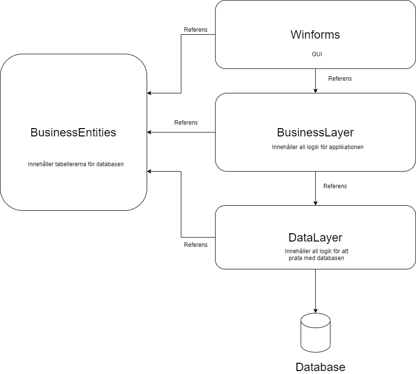

# NOTE! 

This project is NOT actively been worked on!

**This project will not work when you download. It has a few component files removed for security reason**


To summarize this project. We made a CRUD-application, this app had to talk to a database. The connection is MS own Entity Framework (EF) This application was splitted up into three layers (Data-layer, Business-layer, and GUI-layer). This was done to make sure that each layer only does what it is supposed to do.



# SU-Projekt

## Inlogg för olika användare
#### Reception
- användarnamn: jacob
- lösenord: jacob

#### Butik
- användarnamn: Tommy
- lösenord: tommy

#### Skidskola
- användarnamn: admin
- lösenord: admin

#### Skidlärare
- användarnamn: emmy
- lösenord: emmy

## Hur man jobbar med "Fork" på GitHub
- Hur fork fungerar: https://www.youtube.com/watch?v=HbSjyU2vf6Y
- Hur Github fungerar i Visual Studio: https://www.youtube.com/watch?v=jUiuIAZt6Dw
- Hur branches fungerar: https://www.youtube.com/watch?v=QV0kVNvkMxc
- ihopsättning av branches: https://www.youtube.com/watch?v=XX-Kct0PfFc

## Överblick på struktur


## För att få ladda upp kod på GitHub
1. Ta ner existerande kod från GitHub
2. Koden som du själv skriver måste fungera.
3. Pusha upp den nya koden. Skriv kommentar om vad som har gjorts.

## Standard: Notation
### Arv
- När man skall ärva från en klass, ärv från dess Interface istället för klassen.

### Classer och interfaces
Classer skall börja med versal följt av kamelnotation
```
GenericRepository
```

Interfaces skall börja "I" följt av classens namn, där första tecekn skall vara versal följt av kamelnotation
```
IGenericRepository
```

### Funktioner & Variabler
Funktioner börjar med versal och följer sedan kamelnotationen. 
- AddKund()

Variabler kommer att se olika ut beroende på om de är **public** eller **private**.
- Public: börjar med små bokstäver och följer sedan kamelnotation. 
```
public string lastName
```

- Private: börjar med "_", sedan liten bokstav och efter det följer den kamelnotation. 
```
private string _lastName
```

### Objekt i GUI
Kommer att använda kamelnotation under arbetets gång med en förkortning av det objekt man skall använda framför.
- TextBox: tb. Kommer att se följande ut: tbFaktura.
- Label: lbl. Kommer att se följande ut: lblFakturor.
- Forms: frm. Kommer att se följande ut: frmAdmin.
- Buttons: btn. Kommer att se följande ut: btnSpara.
- GridView: gv. Kommer att se följande ut: gvKund.

## Skicka med vin inloggning
- en textfil med inloggningsuppgifter för de olika rollerna

## Ersättning för caluburn micro
**VI UNDVIKER WPF**
Alternativ:
- MVVM Light: https://github.com/lbugnion/mvvmlight (1)
- Prism: https://github.com/PrismLibrary/Prism (2)
- Catel: https://github.com/Catel/Catel (3)
- Stylet: https://github.com/canton7/Stylet (4)
- ReactiveUI: https://github.com/reactiveui/ReactiveUI (5)
- MvvmCross: https://www.mvvmcross.com/ (6)

Vilken av dessa ska vi använda?

## GitHub WorkFlow - Terminal
### 1. Fetch
Kontrollerar om det har kommit några nya "commits"

### 2. Pull 
Tar hem den senaste versionen

```
git pull origin
```
### 3. Branches
kolla vilken branch mman beginner sig i 

```
git branch
```

Byt branch

```
git checkout <branchName>
```

### 4. Kodning
Utvecklar applikationen på sin egna lokala maskin.

Kontrollera så att koden har kompilerats

### 5. Commit & Push
Commit skapar en ny version och push trycker upp den till github

Lägg till den nya koden/ändringar som skall läggas till
```
git add . (inte bra)
git add "filnamn" (bra)
```

Skapa en commit
```
git commit -m "kommentar (byt ut till det man gjort)"
```

Skicka koden till GitHub
```
git push origing "but ut till branch"
```

## För GitHub
1. stash (sitt egna projekt)
2. pull från master
3. commit stash (viktigt med kommentar)
